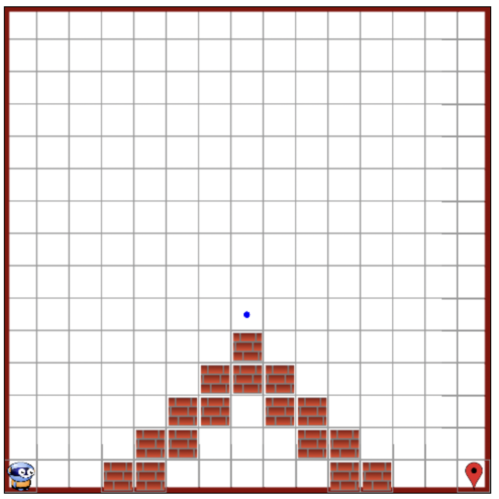

# Schnuppern als Plattform-Entwickler

## Heute erstellen wir eine Webseite über ein Thema deiner Wahl

Herzlich willkommen zu deinem Schnuppertag als Plattform-Entwickler! Heute tauchst du ein in die faszinierende Welt der Webentwicklung, und am Ende dieses Tages wirst du deine eigene Webseite über ein Thema deiner Wahl ins Internet bringen. Bereit, deine Ideen mit der Welt zu teilen? Dann lass uns beginnen!


### Was ist ein WebServer?

Es gibt eine Vielfalt an WebServern – Apache, Nginx, und viele mehr. Deine Aufgabe ist es, einige davon zu erkunden. Finde heraus, was ein WebServer genau ist und warum man solche braucht. Bevor du dich definitiv für einen entscheidest, besprechen wir deine Entdeckungen gemeinsam.


### Wie installiere ich einen WebServer?

Da wir ein Linux system haben, ist die Installation von Software etwas anders als auf einem Windows system. Lese nach wie man auf Ubuntu Software installieren kann und bespeche die Wege die du gefunden hast bevor du etwas installierst.

### Was will ich auf meiner Seite haben?

Wähle ein Thema, das dich begeistert. Sammle Informationen, Texte und Bilder, die du präsentieren möchtest. Skizziere, wie du dir deine Webseite vorstellst – welche Informationen sind dir wichtig, und wie soll deine Seite strukturiert sein? Deine Webseite soll nicht nur informativ, sondern auch ein visuelles Erlebnis sein.

Eine Idee wäre auch, dass du dich über Linux informierst und eine Seite über wichtige Befehle machst. Diese kannst du dann gleich auch verwenden wenn du den WebServer installierst. Falls du sie Seite über ein eigenes Thema machst, solltest du die wichtigsten Linux Befehle trotzdem kennen.

### Wie erstelle ich nun eine Seite?

Mit dem index.html-File als dein Fundament baust du deine Seite auf. Solltest du noch kein solches File haben, zögere nicht, eines zu erstellen. Dein WebServer wird die Brücke sein, die deine Seite mit der Welt verbindet. Die Kunst des HTML wird hierbei dein Werkzeug sein – das Internet bietet dir unzählige Ressourcen, um diese Sprache zu meistern.


### Seite verteilen (Via GitHub)

Was ist nun aber, wenn du von überall auf der Welt darauf zugreifen willst?

Lese vielleicht mal darüber nach, was man da so tun müsste.

Um deine Webseite zugänglich zu machen, wirst du die Magie von GIT und GitHub nutzen. Aber was sind diese genau? Begebe dich auf eine kleine Forschungsreise. Anschließend wirst du dein Werk in das GitHub-Repository einbringen, das du unter https://github.com/Fauli/schnuppern-plattform-entwickler findest. Folge den Anweisungen, um deine Seite hochzuladen und beobachte, wie deine Arbeit live geht.

Füge deine index.html Seite dort ein und füre diese Befehle aus (im Ordner des Repos):

```bash
git add --all
git commit -m "Seite mit Inhalt befüllt"
git push origin main
```

Weisst du was diese Befehle machen?

Was passiert nun wenn du auf die URL unten gehst?

https://fauli.github.io/schnuppern-plattform-entwickler/

### Verteilen einfacher machen

Gibt es einen Weg, diesen Prozess zu vereinfachen? Die Antwort liegt in der Automatisierung. Skripte spielen eine zentrale Rolle in der Automatisierung wiederholender Aufgaben und können dir wertvolle Zeit sparen.

Lese mal über Scripte nach und versuche mit den 3 Befehlen oben dein eigenes zu erstellen.

# Fertig?

## Niki

Wenn du dein Ziel erreicht hast und bereit für neue Herausforderungen bist, besuche https://niki.net-schulbuch.de/ für den nächsten Schritt.

### Welt (Aufbau) 

Deine Aufgabe beginnt damit, eine neue Welt für Niki zu erstellen. Orientiere dich an dem Bild, das du als Vorlage bekommen hast, um die Umgebung so  nachzubilden.



### Aufgabe

Niki steht vor einer Aufgabe: eine Treppe hinaufzusteigen, einen Ball aufzusammeln und die Treppe wieder herunterzusteigen. Doch dazu benötigt er deine Programmierkünste. Dein Ziel ist es, Niki mithilfe von Bausteinen, die du auf der linken Seite der Webseite findest, durch diese Herausforderung zu navigieren.

* Starte einfach: Beginne mit grundlegenden Bewegungen, um Niki die Treppe hinauf und hinunter zu führen. Die Intuition hierbei ist, Niki Schritt für Schritt zu leiten, sodass er seine Aufgaben erfolgreich meistern kann.

#### Weitere Herausfoderung

* Anpassungsfähigkeit: Was passiert, wenn sich die Anzahl der Stufen ändert? Teste deine Logik: Funktioniert sie auch dann, wenn eine Stufe hinzugefügt oder entfernt wird? Dies ist der Test deiner Fähigkeit, flexible und robuste Lösungen zu entwickeln.

* Optimierung: Solltest du feststellen, dass deine aktuelle Lösung nicht auf Veränderungen vorbereitet ist, überlege dir, wie du sie anpassen kannst. Das Ziel ist eine universelle Lösung, die unter verschiedenen Bedingungen fehlerfrei funktioniert.

## Go programmierung: Die geheimnisvolle Zahl

Willkommen zu deiner letzten Herausforderung während deines Schnuppertages als Plattform-Entwickler!

Nachdem du deine Fähigkeiten in der Webentwicklung und Logik unter Beweis gestellt hast, tauchen wir nun in die spannende Welt der Programmierung ein. Deine Aufgabe wird es sein, ein interaktives Programm in der Sprache Go zu erstellen, das deine logischen Fähigkeiten und dein Verständnis für Algorithmen herausfordert. Bereite dich vor auf ein Spiel, in dem du den Geheimnissen der Zahlen auf die Spur kommst!

### Aufgabenstellung: Errate die Zahl

Dein Programm soll ein  Spiel werden, in dem der Computer eine Zufallszahl zwischen 1 und 100 "ausdenkt". Der Nutzer – in diesem Fall du oder jemand, der dein Programm testet – hat die Aufgabe, diese Zahl zu erraten. Klingt einfach? Warte ab, es gibt einen Twist!
Deine Mission

* Initialisierung: Dein Programm soll beim Start eine Zufallszahl zwischen 1 und 100 generieren. Diese Zahl bleibt geheim und ist die Zahl, die der Nutzer erraten muss.

* Interaktion: Das Programm fordert den Nutzer auf, eine Zahl einzugeben, um zu raten, welche Zahl der Computer sich "ausgedacht" hat.

* Feedback geben: Nach jedem Versuch gibt das Programm Feedback:
    * Wenn die geratene Zahl niedriger ist als die gesuchte Zahl, soll das Programm dem Nutzer mitteilen: "Die gesuchte Zahl ist höher."
    * Ist die geratene Zahl höher, lautet die Rückmeldung: "Die gesuchte Zahl ist niedriger."

* Sieg oder Niederlage: Errät der Nutzer die Zahl, gratuliert das Programm ihm und teilt ihm mit, wie viele Versuche er benötigt hat.

* Spielende: Nachdem die Zahl erraten wurde, endet das Spiel.

 ### Technische Hinweise

* Nutze die Funktionen von Go, um eine Zufallszahl zu generieren. Du kannst rand.Intn aus dem Paket math/rand verwenden, denke aber daran, den Generator mit rand.Seed zu initialisieren.
* Für die Eingabeaufforderung und das Lesen von Nutzereingaben kannst du fmt.Scanln verwenden.
* Um Schleifen zu implementieren, mit denen du Eingaben wiederholen und Bedingungen überprüfen kannst, eignet sich die for-Schleife hervorragend.
* Vergiss nicht, die Nutzereingaben auf ihre Gültigkeit zu prüfen und sicherzustellen, dass nur Zahlen zwischen 1 und 100 akzeptiert werden.
